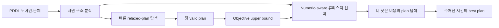

# 로봇 Numeric Planning 연구 문제와 방법 후보

> **현재 상태:** 특정 방법론은 아직 선택하지 않았다. 최신 문제 정의와 기존
> 휴리스틱의 한계 종합은
> [방법론을 열어 둔 문제 정의](./15_방법론을_열어둔_numeric_planning_문제정의.md)를
> 기준으로 한다. 이 문서의 LLM, anytime, cost partitioning 항목은 확정안이 아니라
> 비교할 후보들이다.

## 1. 연구 배경

로봇이 실제 환경에서 작업하려면 이동 경로만 정하는 것으로는 부족하다. 배터리,
연료, 시간, 적재량, 물과 같은 수치 자원을 함께 고려해야 한다. 이런 문제는
numeric planning으로 표현할 수 있다.

로봇 planning에서는 두 가지 요구가 동시에 존재한다. 첫째, 로봇이 사용할 수 있는
실행 가능한 plan을 빨리 찾아야 한다. 둘째, 찾은 plan이 불필요한 이동이나 자원
사용을 너무 많이 포함하지 않아야 한다. 즉, **빠른 첫 plan**과 **낮은 실행비용**이
모두 중요하다.

본 연구의 실험에서는 이 두 목표 사이의 차이가 명확하게 드러났다. Metric-FF와 같은
relaxed-plan 기반 planner는 대부분의 문제에서 매우 빨리 plan을 찾았다. 반면
수치 자원의 변화를 더 자세히 계산하는 휴리스틱은 plan을 찾았을 때 더 낮은
objective를 얻는 경우가 있었지만, 탐색이 오래 걸리거나 timeout이 발생했다.

이 결과는 특정 휴리스틱 하나를 모든 로봇 문제에 적용하는 방식에 한계가 있음을
보여 준다. 휴리스틱이 다루는 수치 정보와 실제 도메인의 자원 구조가 잘 맞을 때는
성능이 좋지만, 그렇지 않으면 탐색이 크게 늘어날 수 있다.

## 2. 사전 실험에서 발견한 현상

전체 실험 결과는
[p000~p004 최종 결과표](./09_p000-p004_최종결과_표.md)에 정리했다. 그중 본 연구 방향과
직접 연결되는 결과는 다음과 같다.

### 2.1 빠른 relaxed-plan 계열

Metric-FF `numeric-hff`는 30개 문제를 모두 풀었고 valid plan 생성 시간의 중앙값은
0.227초였다. Count Downward Agile `irhff`도 30개 중 28개를 풀었다. 이들은
문제를 단순화한 relaxed plan을 만들어 탐색의 길잡이로 사용한다.

이 방식은 높은 coverage와 빠른 속도를 보였다. 하지만 자원 경쟁이 심한 문제에서는
plan objective가 높아지기도 했다. Metric-FF가 찾은 Logistics p004 plan의 objective는
774였으며, 같은 문제의 관측 최저값은 196이었다. Watering p004에서도 Metric-FF는
0.225초 만에 plan을 찾았지만 objective는 관측 최저값보다 59.0% 높았다.

따라서 relaxed-plan 방식은 **일단 plan을 찾는 능력**은 뛰어나지만, 모든 도메인에서
**실행비용이 낮은 plan을 찾는 능력**까지 보장하지는 않았다.

### 2.2 수치 정보를 더 많이 사용하는 계열

NFD `irhadd`와 ENHSP `hadd`, `hradd`는 행동 반복, 수치 목표까지의 비용 등을
더 적극적으로 사용한다. 이들은 성공한 문제에서 상대적으로 좋은 objective를
얻는 경우가 많았다. 예를 들어 NFD `irhadd`는 Logistics p004에서 0.855초 만에
관측 최저값보다 5.6% 높은 plan을 찾았다. ENHSP `hadd`와 `hradd`는 같은 문제에서
관측 최저 objective 196을 찾았다.

그러나 NFD `irhadd`는 30개 중 3개에서 timeout됐고, ENHSP `hadd`와 `hradd`는 각각
5개에서 timeout됐다. 수치 정보를 더 많이 반영한다고 해서 항상 좋은 것은
아니었다.

### 2.3 도메인과 휴리스틱의 구조적 궁합

Logistics p004에서 NFD `irhadd`는 582개 상태만 확장하고 plan을 찾았다. 여러
package를 각각 배송하는 구조와 하위 목표의 비용을 더하는 `irhadd`의 방식이 잘
맞았던 것으로 해석할 수 있다.

반면 Watering p004에서는 6,937,821개 상태를 확장하고도 300초 안에 plan을
찾지 못했다. Watering에서는 위치, 물, 배터리, 충전 장소와 급수 장소가 함께
엮혀 있다. Interval 기반 추정은 물과 배터리를 각각 다시 보충할 수 있다는 사실은
알 수 있지만, 현재 위치에서 남은 두 자원으로 특정 경로를 실제로 수행할 수
있는지를 충분히 표현하지 못한다.

이 결과는 다음 해석으로 요약할 수 있다.

> 휴리스틱의 성능은 수치 정보를 얼마나 많이 계산하는지만으로 결정되지 않는다.
> 휴리스틱이 가정하는 문제 구조와 실제 도메인의 자원 구조가 얼마나 잘
> 맞는지가 중요하다.

## 3. 연구 문제 정의

구체적인 문제 정의는 다음과 같다.

> Sequential numeric planning에서 자원 제약의 강도와 개수만으로는 기존
> 휴리스틱의 탐색 난도와 first-plan quality를 설명할 수 없다. 같은 제약도 어떤
> problem에서는 탐색량을 줄이고 다른 problem에서는 탐색량이나 plan cost를
> 증가시키지만, 이 방향 차이를 상태·action 수준에서 측정하고 예측하는 설명 변수가
> 없다.

이 문제에서 다음 연구 질문이 나온다.

> **Resource slack, replenishment 구조와 horizon을 통제했을 때, failure revelation
> depth와 persistent branching이 기존 numeric heuristic의 값 오류, 상태 확장,
> first-plan time과 objective 변화를 설명할 수 있는가?**

영문 연구 질문은 다음과 같이 표현할 수 있다.

> **To what extent do failure-revelation depth and persistent branching explain heuristic
> error, search effort, first-plan latency, and plan quality when resource slack,
> replenishment structure, and horizon are controlled?**

Delayed numeric conflict는 이 성능 변화를 설명하는 작업 가설이다. 상태 수준
계측에서 가설이 확인된 뒤에만 휴리스틱 선택·전환, RPG 보강, LP, abstraction 또는
LLM을 해결 방법 후보로 비교한다.

## 4. 세부 연구 질문

6개 benchmark의 domain–problem 구조를 이 질문에 맞춰 분석한 결과는
[Changmin Benchmark 도메인·문제 구조 분석](./12_changmin_benchmark_도메인_문제_구조_분석.md)에
정리했다.
Watering·Logistics의 핵심 자원을 독립적으로 변경한 첫 검증 결과는
[2×2 통제 실험 보고서](./13_수치자원_2x2_통제실험_결과.md)에 정리했다.

### RQ1. 어떤 domain–problem 구조가 지연된 수치 충돌을 만드는가?

> 자원 slack, 보충 가능성, 위치 의존성, 목표 간 자원 공유와 horizon이 잘못된
> 선택의 실패가 드러나는 깊이와 탐색량을 얼마나 설명하는가?

분석 후보로는 다음과 같은 특성을 고려할 수 있다.

- 수치 변수의 수
- 수치 변수를 증가·감소·대입하는 action의 수
- 소모성 자원과 보충 가능한 자원의 수
- 하나의 action이 동시에 변경하는 수치 변수의 수
- symbolic 조건과 수치 조건이 연결된 정도
- 여러 목표가 하나의 자원을 공유하거나 경쟁하는 정도
- 충전소나 급수지처럼 자원 보충 장소가 제한되는지 여부
- 탐색에서 사용하는 action cost와 PDDL objective의 일치 정도

### RQ2. 기존 휴리스틱은 어느 정보를 잃어서 실패하는가?

> Relaxed plan, interval, additive, LP와 abstraction 휴리스틱이 decrease, ordering,
> numeric–symbolic correlation과 objective 정보를 어디서 잃는가?

### RQ3. 미래 제약을 어느 정도까지 계산해야 이득인가?

> 총수요 lower bound, interval, 작은 LP, landmark, abstraction과 bounded lookahead
> 중 어떤 추론이 추가 계산비용보다 큰 pruning 이득을 만드는가?

### RQ4. 그 이득이 새로운 domain과 problem에도 유지되는가?

> 특정 benchmark에 맞춘 규칙을 넘어, 보지 못한 자원 구조와 더 긴 horizon에서도
> coverage, first-plan latency 또는 objective를 개선하는가?

## 5. 해결 방법 후보: 아직 선택하지 않음

다음 항목은 서로 경쟁하는 방법 후보다. 현재 결과는 어느 하나를 핵심 방법론으로
확정할 만큼 충분하지 않다.

### 5.1 LLM 기반 휴리스틱 선택

LLM이 PDDL domain과 problem을 읽고 적합한 planner–heuristic 구성을 선택하게 할 수
있다. 단, LLM이 planner 이름만 직접 고르게 하면 선택 이유를 검증하기 어렵다.
먼저 도메인의 자원 구조를 정형화한 중간 표현으로 출력하게 하는 방식이 적합하다.

```json
{
  "replenishable_resources": ["water", "battery"],
  "jointly_consumed_resources": [["water", "battery"]],
  "location_dependent_replenishment": true,
  "goal_resource_competition": "high",
  "recommended_strategy": "fast-first-then-resource-aware"
}
```

이 중간 표현을 규칙 기반 또는 학습 기반 선택기에 입력하면, LLM의 설명 능력과
planner의 결정적 실행을 분리할 수 있다.

### 5.2 LLM 기반 휴리스틱 구성

LLM이 매 문제마다 새로운 planner 코드를 작성하게 하면 정확성과 재현성을 확보하기
어렵다. 대신 기존 휴리스틱에 넣을 도메인 지식을 생성하게 하는 방식을 고려할 수
있다.

- 휴리스틱 파라미터 선택
- redundant numeric constraint 생성
- 자원 간 결합을 나타내는 보조 변수 생성
- numeric PDB의 pattern과 abstraction 후보 생성
- 여러 휴리스틱의 가중치와 시간 배분 결정
- search configuration 생성

특히 Watering p004에서 ENHSP `hadd`는 timeout됐지만 `hradd`는 0.871초 만에 관측
최저 objective를 찾았다. 이 결과는 도메인에 필요한 redundant numeric constraint를
자동으로 발견하는 방향의 가능성을 보여 준다.

### 5.3 Cost partitioning과 numeric abstraction

Cost partitioning은 여러 하위 문제가 같은 action cost를 중복해 사용하지 않도록 비용을
나누는 방식이다. Numeric PDB나 domain abstraction과 결합하면 plan quality를 위한
강한 추정값을 만들 수 있다.

현재 실험에서 numeric PDB와 cost-partitioning 계열은 큰 문제에서 메모리를 많이
사용했다. 따라서 모든 pattern을 사용하기보다 로봇 자원 구조와 관련된 작은
abstraction을 선택하는 방향이 필요하다. LLM은 어떤 변수를 하나의 abstraction으로
묶을지, 어떤 pattern을 제외할지를 제안하는 역할을 할 수 있다.

### 5.4 Relaxed planning graph 개선

Metric-FF의 높은 coverage와 빠른 계산을 유지하면서, 로봇 자원의 핵심 정보만
추가하는 방향이다. 모든 자원 상태를 정확하게 계산하는 대신 다음과 같은 lower
bound를 사용할 수 있다.

- 남은 작업을 위한 최소 자원 수요
- 필수 보충 횟수의 lower bound
- 보충 장소까지의 최소 이동비용
- 동시에 감소하는 자원 쌍
- 여러 목표가 공유하는 자원의 총수요
- 현재 자원으로 처리할 수 있는 목표 수

Watering의 경우 남은 총 물 수요와 현재 물의 차이로 최소 급수 횟수를 계산하고,
남은 이동과 급수에 필요한 배터리로 최소 충전 횟수를 추정할 수 있다. 정확한 경로를
미리 계산하지 않아도 단순 relaxed plan보다 강한 탐색 신호를 제공할 수 있다.

### 5.5 `irhff`·`irhadd`의 coverage 개선

`irhadd`가 실패하는 원인을 휴리스틱 계산 비용, plateau, 메모리 사용, 오류가
큰 추정 중 어느 것인지 먼저 분리해야 한다. Watering p004의 경우에는 유망해 보이는
상태가 너무 많이 생기는 plateau가 주요 문제로 보인다.

개선 방법으로는 다음을 고려할 수 있다.

- relaxed-plan preferred operator 활용
- relaxed plan과 `irhadd`를 함께 사용하는 다중 휴리스틱 탐색
- 자원 부족량을 보조 휴리스틱으로 사용
- 빠른 planner가 찾은 plan을 objective upper bound로 사용
- 탐색이 정체되면 다른 휴리스틱으로 전환
- 여러 open list를 두고 서로 다른 평가값에 따라 번갈아 확장

## 6. 방법 후보 A: 자원 구조 기반 anytime planning

한 가지 후보는 하나의 휴리스틱으로 모든 목표를 달성하려 하기보다, 탐색 시간에 따라
휴리스틱의 역할을 나누는 것이다. 이는 아직 제안 방법으로 확정된 구성이 아니다.

1. Metric-FF 또는 `irhff`로 실행 가능한 첫 plan을 빠르게 찾는다.
2. 첫 plan의 objective를 현재 upper bound로 저장한다.
3. `irhadd`, LM-cut, numeric abstraction 또는 cost partitioning 기반 탐색을 실행한다.
4. 현재 plan보다 objective가 낮은 plan을 찾으면 바꾼다.
5. 시간 제한이 되면 그때까지 찾은 가장 좋은 plan을 반환한다.



이 방식은 로봇 시스템의 운용 요구와도 맞는다. 당장 사용할 수 있는 plan을 먼저
확보하고, 로봇이 실행을 시작하기 전까지 남은 시간을 plan 개선에 사용할 수 있다.

## 7. 평가 방법

### 7.1 평가 축

이 연구에서는 planner의 성능을 하나의 값으로 합치지 않고 다음 축으로 나누어
평가해야 한다.

| 평가 축 | 질문 |
| --- | --- |
| First-plan latency | 언제 처음 valid plan을 찾았는가? |
| Coverage | 제한 시간 안에 valid plan을 찾았는가? |
| Plan objective | 찾은 plan의 실행비용은 얼마인가? |
| Improvement rate | 시간이 더 주어졌을 때 plan이 얼마나 빨리 좋아지는가? |
| Search effort | 상태 확장, 생성, 재열기 횟수와 메모리 사용량은 얼마인가? |
| Generalization | 새로운 도메인과 문제 크기에서도 작동하는가? |

### 7.2 시간에 따른 plan quality

로봇 planning에서 "그럴듯한 plan을 빨리 찾는다"는 목표를 평가하려면 최종
objective만 보면 안 된다. 시간 (t)까지 찾은 가장 좋은 plan의 비용을 다음과 같이
정의할 수 있다.

$$
Q(t)=
\begin{cases}
\infty, & t\text{까지 valid plan이 없는 경우} \\
J(\pi_t), & t\text{까지 찾은 가장 좋은 plan의 비용}
\end{cases}
$$

0.1초, 1초, 10초, 60초, 300초 시점의 (Q(t))를 기록하면 빠른 relaxed-plan 방식과
느리지만 정밀한 numeric-aware 방식을 같은 틀에서 비교할 수 있다. 최종 비교에서는
시간–품질 곡선의 area under the curve도 함께 사용할 수 있다.

### 7.3 필수 baseline

제안 방법의 효과를 알기 위해 다음 baseline과 비교해야 한다.

- Metric-FF `numeric-hff` 단일 실행
- Count Downward `irhff` 단일 실행
- NFD `irhadd` 단일 실행
- ENHSP `hadd`, `hradd` 단일 실행
- 모든 planner에 동일한 시간을 나누는 단순 portfolio
- 수작업 규칙 기반 휴리스틱 선택기
- 전통적인 특징 기반 머신러닝 선택기
- LLM 기반 선택기
- 빠른 첫 plan 후 numeric-aware 탐색을 수행하는 anytime 방법

LLM 기반 방법은 단순 portfolio나 작은 규칙 기반 선택기보다 좋은 결과를 보여야 그
복잡도를 정당화할 수 있다.

## 8. 단계별 연구 계획

### 1단계: 문제 구조와 실패 시점 계측

자원 slack과 horizon을 독립적으로 바꾸고, 잘못된 선택이 몇 action 또는 relaxed-plan
layer 뒤에 dead end로 드러나는지 측정한다. 휴리스틱별로 잃는 상관관계도 기록한다.

### 2단계: 최소 정보 추가 실험

총수요, refill lower bound, interval coupling, 작은 LP 등 비용이 낮은 후보부터
추가한다. 휴리스틱 계산시간 증가와 확장 감소를 함께 비교해 실제 순이득을 확인한다.

### 3단계: 방법 후보 선택과 일반화 검증

RPG 보강, LP, landmark, abstraction, portfolio와 LLM 보조 중 통제실험에서 지지되는
후보만 구현한다. 이후 보지 못한 domain과 더 긴 problem에서 일반화를 검증한다.

## 9. 예상 기여

방법을 확정하기 전 단계에서 기대할 수 있는 기여는 다음과 같다.

1. Delayed numeric conflict와 failure revelation depth를 측정 가능한 형태로 정의한다.
2. 기존 휴리스틱이 잃는 미래성, ordering, numeric–symbolic correlation과 표현 범위를
   체계적으로 비교한다.
3. 추가 추론비용과 pruning 이득의 관계를 밝힌다.
4. 선택된 방법이 빠른 첫 plan, coverage와 objective에 주는 효과를 검증한다.

## 10. 현재 결론과 다음 검증 과제

현재 실험만으로 relaxed-plan, interval, cost partitioning 중 하나가 로봇 numeric
planning의 일반적인 해답이라고 결론낼 수는 없다. 확인된 사실은 휴리스틱별로
속도, coverage, plan quality 사이에 다른 장단점이 있으며, 도메인의 자원 구조에
따라 성능 순위가 바뀐다는 것이다.

다음 단계에서는 다음을 우선 검증해야 한다.

1. Delayed numeric conflict와 failure revelation depth를 재현성 있게 측정할 수 있는가?
2. 각 휴리스틱이 실제로 어느 numeric–symbolic 관계를 잃는가?
3. 가장 작은 추가 정보로 실패 경로를 얼마나 일찍 제거할 수 있는가?
4. 추가된 휴리스틱 계산비용보다 상태 확장 감소가 큰가?
5. 그 효과가 새로운 domain과 더 긴 problem에서도 유지되는가?

이 검증을 마친 뒤에 RPG 보강, LP, abstraction, portfolio 또는 LLM 보조 중 어떤
방법을 사용할지 결정한다. 현재는 문제와 평가 기준만 고정하고 해결 수단은 열어 둔다.
