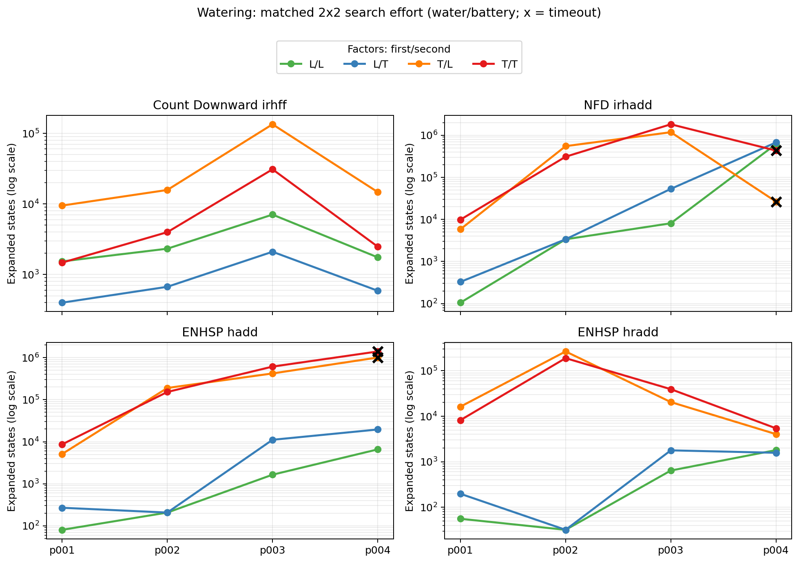
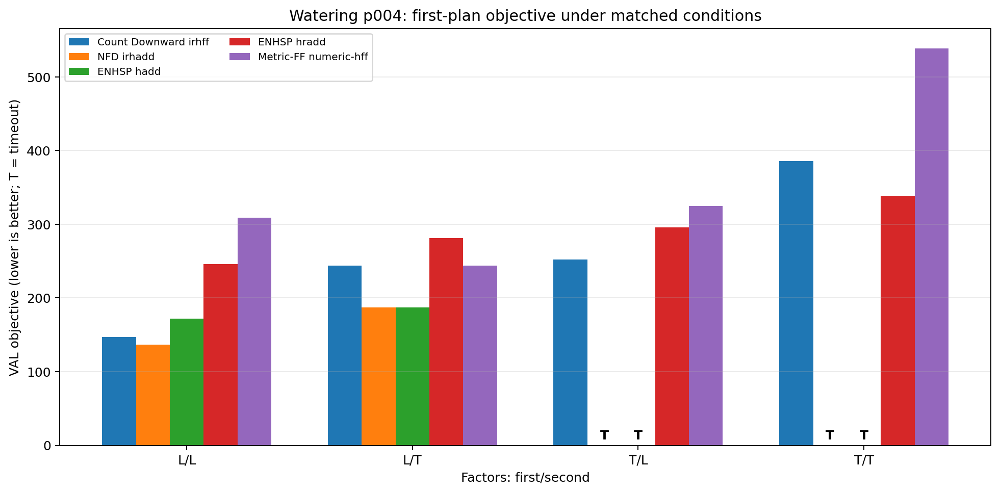
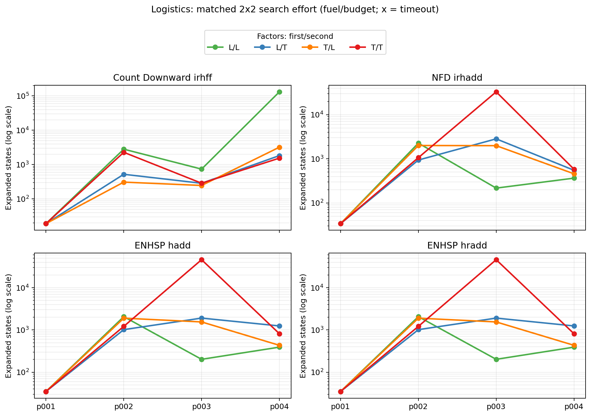
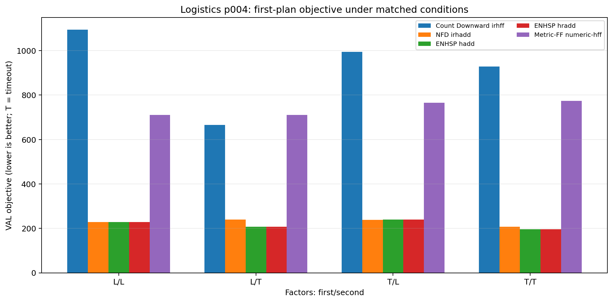

# Watering·Logistics 수치 자원 2×2 통제 실험

## 1. 목적

기존 `p001~p004`는 문제 크기와 자원 여유도가 함께 변한다. 따라서 Watering p004에서
탐색이 크게 늘어난 원인이 식물 수인지, 물인지, 배터리인지, 두 자원의 결합인지
분리할 수 없었다.

이 실험은 각 `p001~p004`의 graph, object, goal, 자원 복구 위치와 action schema를 그대로
두고, 핵심 수치 자원 두 개만 loose/tight로 변경했다. 이로써 각 자원의 단독 효과와
두 자원의 결합 효과를 확인했다.

## 2. 실험 설계

### 2.1 Watering

| 조건 | Water capacity | Battery capacity |
| --- | --- | --- |
| L/L | 총 plant demand와 같음 | 원본의 3배 |
| L/T | 총 plant demand와 같음 | 원본값 |
| T/L | 원본값 | 원본의 3배 |
| T/T | 원본값 | 원본값 |

Water loose 조건에서는 물통을 한 번 가득 채우면 모든 demand를 처리할 수 있다.
Water tight은 기존 problem의 물통 용량을 유지하여 반복 refill을 필요로 한다. Battery
loose는 원본 capacity의 3배로, tight는 원본값으로 설정했다. 초기 battery level은 항상
변경한 capacity와 같게 두었다.

### 2.2 Logistics

| 조건 | Fuel capacity/initial fuel | Budget |
| --- | --- | --- |
| L/L | 원본의 3배 | 원본의 3배 |
| L/T | 원본의 3배 | 원본값 |
| T/L | 원본값 | 원본의 3배 |
| T/T | 원본값 | 원본값 |

초기 pilot에서 loose를 1000으로 두었더니 Count Downward의 interval 범위가 지나치게 커져
별도의 numeric magnitude 효과가 섞였다. 최종 실험에서는 loose를 원본의 3배로
조정했다. 1000 조건의 Logistics 결과는 최종 분석에서 제외했다.

### 2.3 실행 조건

| 항목 | 값 |
| --- | --- |
| Source problems | Watering·Logistics `p001~p004` |
| Matched variants | problem별 4개, domain별 16개 |
| Planner–heuristic | 5개 |
| 최종 분석 case | 160개 |
| Timeout | 60초 |
| Memory | 12 GiB |
| 병렬 실행 | 없음 |
| Plan 검증 | VAL |

비교한 configuration은 Metric-FF `numeric-hff`, Count Downward `irhff`, NFD `irhadd`,
ENHSP `hadd`, ENHSP `hradd`다. 상태 확장 수는 각 planner 내의 조건 변화만
비교했다. Planner마다 state 표현과 카운터 의미가 다를 수 있으므로 서로 다른 planner의
절대 expanded 값을 직접 비교하지 않았다.

실험 재현 스크립트는
[`controlled_resource_experiment.py`](../../scripts/run/controlled_resource_experiment.py), 결과 통합과 그래프 생성은
[`analyze_controlled_resource_experiment.py`](../../scripts/analyze_controlled_resource_experiment.py)다. 통합 원시 결과는
[`combined.csv`](./figures/controlled-resource/combined.csv)에 있다.

## 3. Watering 결과

### 3.1 반복 refill이 numeric-aware 탐색을 크게 늘렸다

`p001~p003`에서 water만 loose에서 tight으로 바꿀 때 expanded-state 비율의 중앙값은
다음과 같다. 각 planner에서 battery loose/tight 두 비교를 모두 포함했다.

| Planner–heuristic | Water tight/loose expanded 중앙 비율 |
| --- | ---: |
| Count Downward `irhff` | 6.5배 |
| NFD `irhadd` | 73.6배 |
| ENHSP `hadd` | 160.4배 |
| ENHSP `hradd` | 165.9배 |

배터리만 loose에서 tight으로 바꿀 효과는 numeric-aware 세 configuration에서 중앙
1.5~1.6배였다. Count Downward에서는 오히려 0.3배로 줄었다. Tight battery가 실행
가능한 action과 경로를 잘라 탐색 공간을 줄였기 때문으로 해석할 수 있다.

따라서 초기 가설인 "물과 배터리가 동시에 tight해서만 어렵다"는 수정해야 한다.
**반복 물 보충이 단독으로도 가장 큰 탐색 증가를 만들었고, 배터리 tightness는 인스턴스와
휴리스틱에 따라 추가 비용을 만들거나 오히려 가능한 경로를 줄였다.**

### 3.2 p004에서 water tight만으로 timeout이 발생했다

| Planner | L/L | L/T | T/L | T/T |
| --- | ---: | ---: | ---: | ---: |
| Metric-FF `numeric-hff` | 0.20초 / 309 | 0.20초 / 244 | 0.20초 / 325 | 0.20초 / 539 |
| Count Downward `irhff` | 0.20초 / 147 | 0.20초 / 244 | 0.40초 / 252 | 0.20초 / 386 |
| NFD `irhadd` | 44.17초 / 137 | 28.91초 / 187 | **Timeout** | **Timeout** |
| ENHSP `hadd` | 1.00초 / 172 | 1.41초 / 187 | **Timeout** | **Timeout** |
| ENHSP `hradd` | 0.60초 / 246 | 0.60초 / 281 | 0.80초 / 296 | 0.80초 / 339 |

각 셀은 `planning time / VAL objective`다. NFD `irhadd`와 ENHSP `hadd`는 물이 tight하면
배터리가 loose해도 60초 안에 plan을 찾지 못했다. 배터리 결합이 필요조건은
아니었다.

NFD `irhadd`는 p004 L/L에서도 61만 상태를 확장하고 44초를 사용했다. 수치
제약을 풀어도 이 인스턴스의 경로·plant 조합이 `irhadd` A*에는 쉽지 않았다. 그러나
water를 tight하게 만들면 plan 발견 자체가 실패했으므로 반복 refill이 명확한 추가
병목이다.

### 3.3 `hradd`는 p004의 실패 경계를 바꾸었다

ENHSP `hradd`는 p004의 네 조건을 모두 0.8초 이내에 풀었다. T/T에서도 5,435개
상태만 확장했다. 같은 ENHSP의 `hadd`는 T/L에서 101만, T/T에서 141만 상태를
확장한 후 timeout됐다.

이 결과는 redundant numeric constraint가 Watering p004에서 누락된 자원 진행 신호를
크게 보강했다는 가설을 지지한다. 하지만 `hradd`가 항상 더 좋은 plan을 찾는 것은
아니다. p004 L/L에서 `hradd`의 objective는 246이었고 NFD `irhadd`의 objective는 137이었다.
즉 `hradd`는 이 실험에서 coverage와 속도를 크게 높였지만 plan quality 우위를 항상
보장하지는 않았다.

### 3.4 Relaxed-plan 계열은 coverage를 유지했지만 objective가 변했다

Metric-FF와 Count Downward는 Watering 16개 matched variant를 모두 풀었다. p004 T/T에서도
각각 0.20초에 plan을 찾었다. 그러나 같은 조건의 관측 최저 objective 339에 비해
Metric-FF는 539, Count Downward는 386이었다.

p004의 조건별 관측 최저값과 초과율은 다음과 같다.

| 조건 | 관측 최저 | Metric-FF 초과율 | Count Downward 초과율 |
| --- | ---: | ---: | ---: |
| L/L | 137 | 125.5% | 7.3% |
| L/T | 187 | 30.5% | 30.5% |
| T/L | 252 | 29.0% | **0.0%** |
| T/T | 339 | 59.0% | 13.9% |

Relaxed-plan 방식을 하나로 묶어 품질이 항상 나빠진다고 말할 수는 없다. Count Downward는
T/L에서 가장 빠르면서 관측 최저 plan을 찾았다. 정확한 결론은 **Metric-FF는 자원
조건에 관계없이 높은 coverage와 일정한 planning time을 보였지만, objective 품질은 조건에
따라 크게 흔들렸다**는 것이다.

## 4. Logistics 결과

### 4.1 Watering처럼 하나의 자원이 일관되게 지배하지 않았다

Logistics에서는 80개 case가 모두 60초 안에 valid plan을 찾았다. Fuel이나 budget을
tight하게 만든다고 탐색량이 항상 늘어나지는 않았다. 제약이 약해지면 더 많은
경로와 주유 선택이 가능해져 탐색이 커지는 경우도 있었다.

예를 들어 Count Downward p004는 L/L에서 131,514개 상태를 확장하고 17.87초를
사용했지만 T/T에서는 1,541개 상태만 확장하고 0.60초에 plan을 찾았다. Tight
제약이 더 쉬운 휴리스틱 문제를 만든 것이 아니라, 이 configuration에서 나쁜 선택지를
먼저 제거한 것으로 보아야 한다.

### 4.2 문제 번호와 탐색 난이도가 단조로운 관계가 아니었다

NFD `irhadd`는 p003 T/T에서 32,946개 상태를 확장하고 15.86초를 사용했다.
ENHSP `hadd/hradd`는 같은 조건에서 45,992개 상태를 확장하고 약 58~60초를
사용했다. 그러나 package가 더 많은 p004 T/T에서는 NFD가 581개, ENHSP가
815개만 확장했다.

따라서 package 수만으로 Logistics 난이도를 예측할 수 없다. Package의 출발·목표 위치,
truck 시작점, 주유소, highway/local-road topology와 비용의 궁합이 더 큰 영향을 줄 수 있다.

### 4.3 제약을 완화해도 첫 plan objective가 좋아지지 않았다

| Planner | L/L | L/T | T/L | T/T |
| --- | ---: | ---: | ---: | ---: |
| Metric-FF `numeric-hff` | 0.20초 / 710 | 0.20초 / 710 | 0.20초 / 766 | 0.20초 / 774 |
| Count Downward `irhff` | 17.87초 / 1095 | 0.60초 / 666 | 0.80초 / 995 | 0.60초 / 928 |
| NFD `irhadd` | 0.80초 / 228 | 1.00초 / 240 | 0.80초 / 238 | 0.80초 / 207 |
| ENHSP `hadd` | 3.41초 / 228 | 6.02초 / 208 | 3.21초 / 240 | 4.02초 / 196 |
| ENHSP `hradd` | 3.21초 / 228 | 6.02초 / 208 | 3.41초 / 240 | 3.81초 / 196 |

제약이 더 loose해지면 가능한 plan 집합이 커지므로, 이론적인 최적 objective가 더
나빠질 수는 없다. 그런데 실험의 첫 plan은 L/L보다 T/T에서 더 좋은 경우가 있었다.
이는 최적값이 좋아진 것이 아니라, satisficing/weighted search가 제한된 상태공간에서
우연히 더 좋은 첫 plan을 찾은 것이다.

p004에서 NFD와 ENHSP는 모든 조건에서 Metric-FF·Count Downward보다 훨씬 낮은 objective를
찾었다. 이 결과는 Logistics에서 numeric-aware 휴리스틱의 plan-quality 이점이
fuel/budget 통제 후에도 유지됨을 보여 준다.

## 5. 연구 가설의 변경

### 통제 실험 전

> Watering은 물과 배터리가 함께 tight해서 numeric-aware 휴리스틱이 실패했을
> 가능성이 크다.

### 통제 실험 후

> Watering에서 반복 refill을 필요로 하는 물 용량이 numeric-aware 탐색량을 가장 크게
> 늘렸다. Battery tightness는 부가적 효과를 주었지만 p004 timeout의 필요조건은
> 아니었다. `hradd`의 redundant constraints는 이 실패 경계를 크게 완화했다.

Logistics에 대한 가설도 더 조심스럽게 바뀌어야 한다.

> Logistics에서 fuel과 budget의 tightness는 탐색량에 영향을 주지만, 그 방향은
> 단조로운 관계가 아니다. 제약이 탐색 공간을 잘라 오히려 빠르고 좋은 첫 plan을
> 유도하기도 하며, topology와 package 배치가 난이도를 함께 결정한다.

## 6. 현재 결론

1. **Watering의 주요 병목은 반복 refill이다.** 물 용량만 tight해져도 NFD `irhadd`와
   ENHSP `hadd`의 탐색량이 수십~수백 배 늘어났다.
2. **두 자원의 결합만이 원인은 아니다.** p004에서 water tight만으로 timeout이
   재현됐다.
3. **`hradd`는 특정 자원 구조에서 탐색 안정성을 크게 높였다.** 하지만 항상
   가장 좋은 objective를 반환하지는 않았다.
4. **Relaxed-plan 계열은 통제 후에도 높은 coverage를 유지했다.** 다만 Metric-FF의
   objective gap은 Watering·Logistics p004의 여러 조건에서 크게 남았다.
5. **Resource tightness는 항상 난이도를 높이지 않았다.** 더 tight한 제약이 나쁜
   선택지를 제거하여 탐색량을 줄이는 경우도 있었다.
6. **Domain 특징만으로는 부족하다.** 같은 domain의 p003과 p004도 topology·goal 배치에
   따라 어려움이 뒤집혔다. 휴리스틱 선택기는 domain–problem pair를 분석해야 한다.

## 7. 한계와 다음 실험

이 실험은 matched comparison이지만 최종 인과 결론을 위해서는 추가 반복이 필요하다.

- 각 크기에서 random seed가 하나뿐이므로 topology·goal placement 반복이 필요하다.
- Loose를 3배 한 점으로만 설정했으므로 resource ratio를 여러 단계로 바꿄 변화점을 찾아야
  한다.
- 60초 timeout이므로 p004 NFD/ENHSP `hadd`의 water-tight expanded 값은 완료된 탐색량이
  아니라 60초 시점의 검열된 값이다.
- 각 configuration을 한 번씩 실행했으므로 wall-clock 분산을 측정하려면 반복 실행이 필요하다.
- Objective는 조건별 feasible set이 다르므로 각 조건의 최적값 또는 더 강한 관측 최저값과
  비교해야 한다.

다음 우선순위는 Watering에서 같은 graph·plant·시설 배치를 여러 seed로 만들고,
water capacity ratio를 `1.0, 0.7, 0.5, 0.3`으로 변화시켜 expanded state의 변화점을
찾는 것이다. 그 다음 battery factor를 교차하여 water×battery interaction을 정량화해야 한다.
