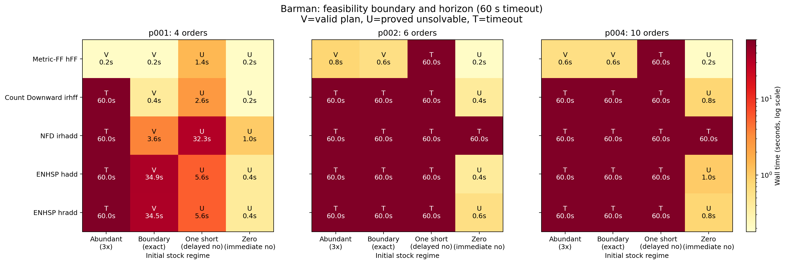

# Numeric planning 난도: domain–problem 상호작용과 Barman 통제실험

## 1. 질문

기존 결과에서는 같은 domain에서도 problem마다 planner–heuristic의 성능이 크게
달라졌다. 이번 분석은 다음 질문을 더 정확히 다룬다.

> Numeric planning은 언제 어려워지는가? 수치 제약이 강할수록 항상 어려운가, 아니면
> action의 실행 가능성이 오랫동안 불확실하고 모순을 늦게 발견할 때 어려운가?

결론부터 말하면 두 번째 설명이 현재 결과에 더 잘 맞는다. Domain은 어떤 자원과
제약이 존재하는지를 정하지만, problem은 그 제약이 실제 탐색에서 언제 action을
차단하는지 정한다. 여기에 휴리스틱이 그 차단을 얼마나 빨리 알아내는지가 결합된다.

```text
난도 ≈ 지속되는 선택지 수 × 모순이 드러나는 깊이 × 휴리스틱의 정보 손실
```

수치 제약이 매우 강해 필요한 action이 처음부터 불가능하면 탐색을 즉시 끝낼 수 있다.
반대로 많은 action이 당장은 가능하지만 긴 행동열 뒤에 자원이 부족해지면, planner는
서로 비슷한 실패 경로를 많이 탐색해야 한다. 따라서 난도는 자원 부족량에 대해
단조롭게 증가하지 않을 수 있다.

## 2. Domain과 problem의 역할

Domain은 난도를 만드는 **기제**를 제공한다.

- 어떤 fluent가 감소하거나 회복되는가
- numeric condition이 어떤 action을 막는가
- 자원과 symbolic 상태가 한 action에서 어떻게 결합되는가
- 실패한 자원 사용을 되돌리거나 보충할 수 있는가

Problem은 그 기제를 **활성화하는 정도**를 정한다.

- 초기 자원과 총 필요량의 차이
- 목표 수와 최소 plan horizon
- 목표 사이의 자원 경쟁
- 이동 graph, 시설과 목표의 위치
- 실패가 드러나기 전까지 가능한 action의 수

따라서 같은 domain이라도 problem마다 난도가 달라지고, 같은 problem도 휴리스틱의
constraint propagation 능력에 따라 난도가 달라진다.

## 3. 기존 Watering·Logistics 결과의 재해석

### 3.1 Watering

Watering 통제실험에서는 물만 tight하게 바꿔도 p004의 NFD `irhadd`와 ENHSP `hadd`가
timeout됐다. 주요 병목은 물과 배터리가 동시에 부족한 상황 자체보다 다음의 긴 반복
구조였다.

```text
식물 방문 → 급수 → 물 감소 → 수도 이동 → refill → 다음 식물 방문
```

작은 물통에서도 각 급수·이동 action은 한동안 실행 가능하다. 어떤 식물 묶음을 한
tour에서 처리할 수 없는지는 여러 action 뒤에 드러난다. Relaxation이 물 감소나 refill
detour를 약하게 반영하면 실패할 방문 순서도 계속 유망하게 보인다. 즉 Watering의
난점은 반복 refill 횟수뿐 아니라 **실패 경로를 늦게 제거하는 긴 자원 horizon**이다.

### 3.2 Logistics

Logistics에서는 연료와 예산을 tight하게 만든 조건이 오히려 쉬워지기도 했다. Count
Downward `irhff`의 p004는 loose/loose에서 131,514개 상태와 17.87초가 필요했지만,
tight/tight에서는 1,541개 상태와 0.60초가 필요했다.

이는 강한 제약이 나쁜 경로를 일찍 제거했기 때문이다. 반대로 loose 조건은 가능한
도로와 차량 선택을 오래 남겨 두어 더 큰 search space를 만들었다. 수학적으로 loose
problem의 feasible plan 집합은 더 크지만, satisficing search가 첫 plan을 찾는 일은
오히려 어려워질 수 있다.

## 4. Barman 통제실험

### 4.1 설계

Barman에서는 symbolic 규모와 재고 조건이 기존 p001~p004에서 함께 변했다. 이를
분리하기 위해 각 source problem의 객체, goal, recipe, container와 action schema를
그대로 유지하고 `dispenser-stock`만 바꿨다.

| Source | 주문 수 | 해석 |
|---|---:|---|
| p001 | 4 | 매우 짧은 horizon |
| p002 | 6 | 짧은 horizon |
| p004 | 10 | 긴 horizon |

각 source problem에 네 stock regime을 적용했다.

| Regime | 설정 | 의미 |
|---|---|---|
| Abundant | 최소 필요량의 3배 | 많은 fill 선택을 허용하는 solvable 문제 |
| Boundary | 정확한 최소 필요량 | 불필요한 재료 사용을 제한하는 solvable 문제 |
| One-short | 가장 많이 필요한 재료가 한 dose 부족 | 실패가 사용 누적 뒤에 드러나는 unsolvable 문제 |
| Blocked-zero | 같은 핵심 재료의 초기 재고가 0 | 필요한 fill이 처음부터 막히는 unsolvable 문제 |

비교 configuration은 Metric-FF `numeric-hff`, Count Downward `irhff`, NFD `irhadd`,
ENHSP `hadd`, ENHSP `hradd`다. 제한시간은 case당 60초이고, 얻은 plan은 VAL로
검증했다. 총 60건 중 10건이 valid plan, 18건이 unsolvable 판정, 32건이 timeout이었다.



### 4.2 p001: 강한 제약이 solvable search를 줄였다

| Planner–heuristic | Abundant | Boundary | One-short | Blocked-zero |
|---|---:|---:|---:|---:|
| Metric-FF `numeric-hff` | Valid 0.2초 | Valid 0.2초 | Unsolved 1.4초 | Unsolved 0.2초 |
| Count Downward `irhff` | **Timeout** | Valid 0.4초 | Unsolved 2.6초 | Unsolved 0.2초 |
| NFD `irhadd` | **Timeout** | Valid 3.6초 | Unsolved 32.3초 | Unsolved 1.0초 |
| ENHSP `hadd` | **Timeout** | Valid 34.9초 | Unsolved 5.6초 | Unsolved 0.4초 |
| ENHSP `hradd` | **Timeout** | Valid 34.5초 | Unsolved 5.6초 | Unsolved 0.4초 |

네 configuration에서 Abundant가 timeout인데 Boundary는 valid plan을 찾았다. 최소
재고는 해를 없애지 않으면서 불필요한 fill과 잘못된 재료 배분을 제거했다. 따라서
solvable problem에서도 자원이 넉넉할수록 search가 쉬워진다는 보장은 없다.

두 unsolvable 조건도 큰 차이를 보였다. Blocked-zero는 모든 configuration이 1초 안에
불가능을 판정했지만, One-short는 1.4~32.3초가 필요했다. 둘 다 해가 없지만 한 dose
부족은 많은 행동열을 실행한 다음에야 모순이 드러난다.

### 4.3 horizon이 길어지면 delayed contradiction이 급격히 어려워졌다

Metric-FF는 p001의 One-short를 1.4초에 불가능으로 판정했지만 p002와 p004에서는 모두
60초 timeout됐다. Count Downward도 p001에서는 2.6초였지만 p002와 p004에서 timeout됐다.

ENHSP `hadd/hradd`는 p002와 p004에서 Abundant, Boundary, One-short를 모두 timeout했지만
Blocked-zero는 0.4~1.0초에 판정했다. 이는 긴 problem에서도 명백한 초기 모순은 빠르게
전파할 수 있지만, 누적 사용 뒤에 나타나는 모순은 쉽게 pruning하지 못한다는 뜻이다.

NFD `irhadd`는 더 강한 예외를 보였다. p002와 p004의 Blocked-zero에서도 timeout됐다.
객관적으로 action이 막혀 있어도 해당 휴리스틱이 이 사실을 goal-level dead end로
전파하지 못하면 search space가 자동으로 줄어들지 않는다.

### 4.4 Barman에서 실제로 어려운 구조

Barman의 난점은 단순한 finite stock이 아니다. 다음 상관관계가 긴 horizon에서
결합된다.

```text
재고 잔량
  × 어떤 shot/shaker가 어떤 재료를 담고 있는가
  × clean/empty/used 상태
  × 두 손의 점유 상태
  × cocktail recipe 순서와 batching
```

One-short problem에서는 대부분의 fill action이 초반에 실행 가능하다. 잘못된 배분의
결과는 여러 주문을 처리한 뒤 마지막 필요한 dose가 없을 때 나타난다. Relaxation이
stock decrease, 용기 재사용 또는 hand occupancy의 상관관계를 잃으면 실제로 실패할
상태도 목표에 가까운 것으로 평가할 수 있다.

## 5. 통합 가설: feasibility ambiguity와 pruning depth

현재 세 domain을 함께 설명하는 가설은 다음과 같다.

> Numeric planning은 수치 제약이 강해서 어려운 것이 아니라, 제약이 많은 action을
> 당장은 허용하면서 장기적으로 일부 행동열만 실패시키고, 휴리스틱이 그 실패를 이른
> 깊이에서 증명하지 못할 때 어려워진다.

이를 측정 가능한 네 요소로 나눌 수 있다.

| 요소 | 의미 | 예시 |
|---|---|---|
| Feasibility slack | 총 필요량 대비 가용 자원의 여유 | stock/required stock, water/demand |
| Persistent branching | 자원 제약 이후에도 남는 action·경로 선택지 | Logistics의 여러 도로, Barman의 fill 순서 |
| Failure revelation depth | 잘못된 선택이 불가능으로 판명되기까지 필요한 행동 수 | 마지막 dose 부족, tour 후반 물 부족 |
| Propagation strength | 휴리스틱이 미래 모순을 현재 dead end로 전파하는 능력 | blocked-zero에서 즉시 infinity를 반환하는가 |

난도는 slack 하나로 예측하기 어렵다. 다음 세 구간으로 보는 편이 정확하다.

1. **즉시 불가능:** 핵심 action이 처음부터 막히고 휴리스틱이 이를 인식하면 쉽다.
2. **경계·애매 구간:** 많은 action이 가능하지만 일부 긴 경로만 성공한다. 가장 어려울
   가능성이 크다.
3. **충분한 여유:** dead end는 줄지만 branching이 커진다. search strategy에 따라 다시
   어려워질 수 있다.

따라서 난도 곡선은 자원량에 대해 단조 증가가 아니라 중간이나 loose 영역에서도
정점이 나타날 수 있다.

## 6. 기존의 일반 방법과 이번 분석의 위치

먼 미래의 numeric constraint를 휴리스틱에 반영하려는 시도 자체는 새로운 발상이
아니다. Numeric planning에는 이미 다음과 같은 일반적인 방법 계열이 있다.

| 기존 방법 계열 | 미래 제약을 다루는 방식 | 주요 한계 |
|---|---|---|
| Numeric relaxed planning graph | 목표까지 필요한 action을 빠르게 전개 | decrease와 목표 간 자원 경쟁을 약하게 볼 수 있음 |
| Interval relaxation | numeric variable의 도달 가능한 하한·상한을 전파 | 변수·목표 사이의 상관관계를 잃을 수 있음 |
| LP/MIP resource-flow heuristic | action 횟수와 총생산·총소비 제약을 함께 계산 | 정확한 action ordering을 약하게 보거나 계산비용이 커짐 |
| Numeric landmark | 모든 plan에 반드시 필요한 수치 조건·action을 추출 | landmark 사이의 긴 순서와 결합을 모두 표현하지 못함 |
| PDB/domain/Cartesian abstraction | 일부 numeric·symbolic 변수를 보존한 축약 문제를 미리 풂 | 추상화 범위와 크기에 따라 정보 손실 또는 큰 계산비용 발생 |
| CEGAR | 가짜 abstract plan이 실패한 원인만 찾아 정밀화 | 현재 numeric 적용 범위가 제한적이고 refinement 비용이 있음 |

따라서 `남은 목표의 최소 자원 수요`, `최소 refill 횟수`, `LP 자원 보존식`,
`numeric landmark`, `CEGAR refinement`는 각각 기존 연구에서 사용되는 일반적 아이디어다.

그러나 다음 명제가 하나의 표준 휴리스틱으로 확립된 것은 아니다.

> Domain–problem pair의 난도를 `가능한 action이 오래 유지되는 정도`와 `numeric 모순이
> 드러나는 깊이`로 측정하고, 이를 이용해 delayed resource conflict를 선택적으로 현재
> heuristic 값에 전파한다.

이번 실험에서 새롭게 얻은 부분은 특정 자료구조나 알고리즘의 발명보다, Watering,
Logistics, Barman의 비단조적인 난도를 **feasibility ambiguity와 pruning depth**라는
하나의 설명으로 연결한 것이다. 이를 실제 휴리스틱으로 구현한다면 기존 RPG, LP,
landmark 또는 CEGAR 중 하나를 기반으로 해야 한다.

또한 완전히 일반적인 해결법은 기대하기 어렵다. 먼 미래의 constraint를 정확하게
판정하는 일은 원래 planning 문제를 푸는 것과 가까워지기 때문이다. 실제 설계의 핵심은
정확도와 계산비용 사이의 선택이다.

- 빠른 방법: 총수요 하한, interval, refill 횟수만 계산
- 중간 방법: relaxed plan의 layer별 resource balance 또는 작은 LP 계산
- 강한 방법: abstraction refinement, MIP 또는 깊은 lookahead 적용

Barman의 finite stock처럼 복구 불가능한 additive resource는 총수요 하한으로 비교적
일반적으로 다룰 수 있다. Watering의 refill과 공간 detour, Logistics의 경로별 연료·예산
상관관계는 ordering과 위치가 포함되므로 더 강한 표현이 필요하다. 임의의 비선형 effect,
`assign`, 여러 변수의 결합까지 모두 허용하면 적용 범위는 더 제한된다.

### 6.1 Hybrid LP–RPG가 보여주는 기존 접근의 경계

Hybrid LP–RPG는 이 연구 질문과 가장 가까운 기존 접근 중 하나다. 이 방법은 relaxed
planning graph로 명제의 도달 가능성을 계산하면서, LP로 action 횟수와 resource의
생산·소비를 함께 제한한다. 따라서 목표에서 필요한 수치 자원을 현재 휴리스틱에
반영한다는 발상 자체는 이미 존재한다.

그러나 원본 LPRPG의 분석과 LP encoding은 numeric fluent가 대체로
producer–consumer resource처럼 동작한다는 가정을 둔다. 로봇 문제에서 흔한 다음
구조는 이 범위를 벗어나거나 원본 구현이 안정적으로 처리하지 못한다.

- 다른 numeric fluent가 effect의 변화량을 결정하는 경우
- `assign`으로 용량이나 충전량을 다시 설정하는 경우
- 보충 action과 위치·순서가 결합되는 경우
- 여러 numeric variable과 symbolic 상태가 함께 action 가능성을 결정하는 경우

Public Release 2를 현재 공통 planner에 설치해 strict 모드로 실행한 결과는 다음과
같았다. 생성된 plan은 공통 adapter로 추출한 뒤 VAL로 검증했다.

| Domain p000 | 원본 LPRPG 결과 | 해석 |
|---|---|---|
| Books | 2-action plan, VAL valid | 원본이 처리할 수 있는 resource 구조 |
| Assembly | 6-action plan, VAL valid | 원본이 처리할 수 있는 resource 구조 |
| Barman | fragment 위반 경고 후 중단 | `liquid-volume`에 적용되는 non-constant effect를 거부 |
| Watering | signal 11 | recharge·assignment가 섞인 분석 중 원본 구현 crash |
| Blocksworld | parser 중단 | `:numeric-fluents`를 읽지 못하는 구형 parser 문제 |
| Logistics | parser 중단 | `:numeric-fluents`를 읽지 못하는 구형 parser 문제 |

Barman에서 fragment 검사를 끄는 `-plananyway`도 signal 11로 종료됐다. 따라서 원본
LPRPG는 여섯 domain을 같은 조건에서 비교할 공통 baseline으로 사용할 수 없다.
Books와 Assembly의 성공은 LP resource reasoning의 가능성을 보여주지만, Barman과
Watering의 결과는 목표로 하는 일반 로봇 numeric 구조에 그대로 적용되지 않음을
보여준다.

여기서 Blocksworld와 Logistics의 실패는 이론적 한계의 증거가 아니다. requirement
표기만 정규화하면 해결될 수 있는 parser 호환 문제다. 반면 Barman의 fragment 거부와
Watering의 crash는 numeric effect 분석 및 LP encoding의 적용 범위와 직접 관련된다.
또한 이 결과는 모든 LP 기반 휴리스틱의 한계를 뜻하지 않는다. 원본 Hybrid LP–RPG의
가정과 공개 구현에 대한 관찰이며, 더 일반적인 LP/MILP encoding은 별도로 설계할 수
있다.

### 6.2 이 결과가 만드는 연구 공백

따라서 연구 동기는 다음처럼 정리할 수 있다.

> Hybrid LP–RPG는 미래의 resource requirement를 LP로 현재 탐색에 반영할 수 있음을
> 보여준다. 그러나 원본 방법과 구현은 producer–consumer 중심의 numeric 구조를
> 대상으로 하며, assignment, replenishment, fluent-dependent effect와 긴 공간적
> detour가 결합된 일반 로봇 문제에는 그대로 적용하기 어렵다. 한편 더 일반적인
> relaxed-plan 휴리스틱은 빠르고 coverage가 높지만 delayed resource conflict를 늦게
> 발견한다. 그러므로 넓은 numeric 표현을 유지하면서 미래의 수치적 불가능성을 낮은
> 비용으로 조기에 전파하는 방법이 필요하다.

현재 단계에서 LPRPG 자체를 개조하는 것을 연구 방향으로 확정하지 않는다. LPRPG는
`미래 자원 추론이 이미 존재한다`는 선행연구인 동시에 `그 추론이 현재 목표 domain에
바로 적용되지는 않는다`는 적용 범위 분석에 사용한다. 이후 제안 방법은 RPG 보강,
부분 LP, interval, landmark, abstraction 중 어느 기반을 택하더라도 이 공백을
해결하는지를 기준으로 평가할 수 있다.

## 7. 연구 질문으로 바꿀 때

아직 특정 planner 구조를 연구 주제로 확정할 필요는 없다. 현재 결과에서 바로 도출되는
문제는 다음과 같다.

> 빠른 numeric relaxed-plan 휴리스틱이 누적 자원, 보충 순서와
> numeric–symbolic 상관관계를 제거하면서 발생시키는 false feasibility가 깊은
> action prefix까지 지속되어, forward search가 미래 dead end를 반복 확장하고 첫
> valid plan 발견이 늦어지는 문제.

이 문제에서 도출되는 중심 연구 질문은 다음과 같다.

> 누적 자원 제약이 여러 action 뒤에 드러나는 deterministic sequential numeric
> planning에서, Metric-FF의 relaxed planning graph가 제공하는 빠른 first-plan 탐색을
> 유지하면서 미래에 infeasible해질 상태와 선택을 더 일찍 식별하여 탐색량과
> first-plan time을 줄일 수 있는가?

이를 검증하기 위한 첫 분석 질문은 다음과 같다.

> Domain–problem pair에서 numeric action feasibility의 불확실성과 failure revelation
> depth를 어떻게 측정하며, 이 값이 휴리스틱별 탐색량·coverage·첫 plan 품질을 얼마나
> 설명하는가?

후보 feature는 다음과 같다.

- 최소 필요 자원 대비 초기 자원 비율
- 최소 refill/recharge 횟수
- 누적 resource constraint에 참여하는 goal 수
- 한 자원을 공유하는 action과 goal의 수
- 보충 또는 복구 가능 여부
- relaxed plan에서 무시되는 decrease 효과 수
- 처음 명백한 자원 충돌이 나타나는 relaxed-plan layer
- numeric gate를 통과한 뒤 필요한 symbolic preparation 길이

기존 휴리스틱 계열별 정보 손실, 방법론에 독립적인 중심 연구 문제와 평가 요구사항은
[방법론을 열어 둔 문제 정의](./15_방법론을_열어둔_numeric_planning_문제정의.md)에
별도로 정리했다. 이 단계에서는 LLM, anytime search, LP, RPG 보강과 abstraction을
모두 경쟁 후보로 두며 어느 하나를 제안 방법으로 전제하지 않는다.

## 8. 한계와 다음 통제실험

- p001, p002, p004는 완전히 nested된 problem이 아니다. 주문 수뿐 아니라 recipe와
  shaker 구성이 달라지므로 cross-instance 차이를 순수 horizon 효과로 단정할 수 없다.
- 각 source 안의 stock 비교는 다른 모든 PDDL 요소를 고정했으므로 stock regime의
  인과효과로 해석할 수 있다.
- 60초 timeout 결과는 실제 해결시간의 하한만 제공한다.
- Unsolvable 판정 실험은 plan finding과 proof of no plan이라는 서로 다른 작업도
  비교한다. 이번 목적은 pruning 시점을 보기 위한 것이므로 둘을 구분해 보고했다.
- 다음에는 같은 recipe와 goal 구조를 반복 복제하는 nested generator로 horizon만
  `4, 6, 8, 10, 12`로 늘리고, stock slack을 `3, 2, 1, 0, -1 dose`로 sweep해야 한다.
- Watering에서는 동일 graph에서 refill 횟수와 수도 거리를 독립적으로 변화시키고,
  Logistics에서는 선택 가능한 경로 수와 연료·예산 gate를 독립적으로 변화시켜야 한다.

## 9. 재현 자료

- LPRPG 설치·호환성 기록: [`12_LPRPG_설치와_실행.md`](../10_플래너_자료/12_LPRPG_설치와_실행.md)
- 실행기: [`controlled_barman_experiment.py`](../../scripts/run/controlled_barman_experiment.py)
- 분석기: [`analyze_controlled_barman_experiment.py`](../../scripts/analyze_controlled_barman_experiment.py)
- 통합 결과: [`combined.csv`](./figures/controlled-barman/combined.csv)
- 원시 p001 run: [`horizon-stock-p001-20260919-201410-818738`](../../results/controlled-barman/horizon-stock-p001-20260919-201410-818738/)
- 원시 p002/p004 run: [`horizon-stock-p002-p004-20260919-194518-753176`](../../results/controlled-barman/horizon-stock-p002-p004-20260919-194518-753176/)
